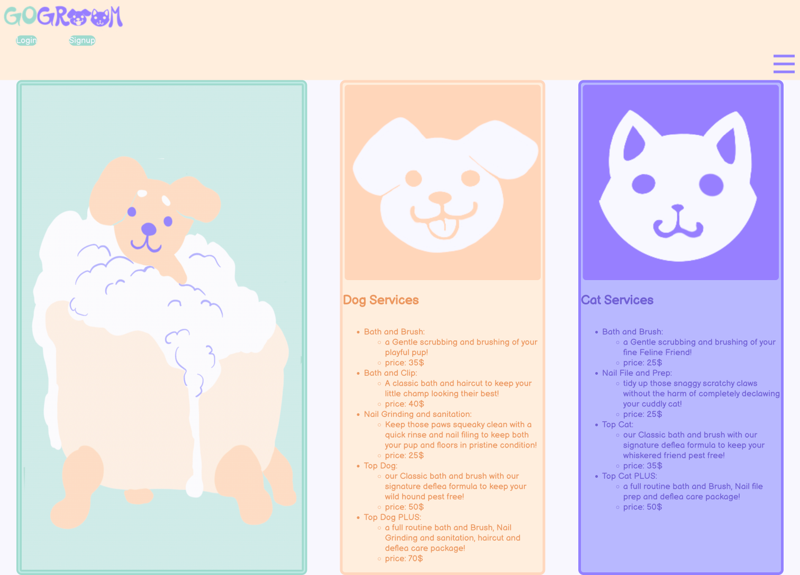

# GoGroom: Top Services for Top Dogs & Cats

This application serves users that are dog and/or cat owners who would like to schedule grooming appointments for their pets. This application allows them to create a user profile with their name and email address. This application will make scheduling appointments for a particular pet based on preferences a much more efficient and informative process.

## Table of Contents

- [Installation](#installation)
- [Usage](#usage)
- [Application Images](#Images)
- [Deployed Application](#deployment)
- [Developers](#developers)

## Installation
Users are able to access the site with the link in this ReadME. This applicatoin is built using React.js. To run the application, clone  the code to your own repository and run "npm i" from the root folder. This will install all dependencies needed in the server and client folders. Once all dependencies are installed you can run "npm run develop" this will start both the client and server concurrently, establish a connection to the MongoDB, and open the application in your default browser.

## Usage
```
WHEN I access the home page,
THEN I am able to view available pet services for cats and dogs
WHEN I select sign up, 
THEN I am able to create and account with an authenticated email and password
GIVEN my account username or password is incorrect
WHEN my authentication does not pass requirements
THEN I will receive an error message
WHEN I log in to the application
THEN I am taken to my profile page with my information, my pet's information, and an option to add a new pet
GIVEN I have not created any pet profiles
THEN I am prompted to create a new pet profile from my pet page
WHEN I create a new pet profile
THEN I will have a pet profile saved to my user profile
WHEN I have successfully created a pet profile
THEN I am able to make a new appointment for my pet
WHEN I navigate to the scheduling page
THEN I am prompted to select my pet, a specific day of the week, a timeblock, and a grooming service
WHEN I submit my appointment information
THEN the appointment will be saved to the database associated to my profile
WHEN I have scheduled an appointment
THEN I can see my appointments on my profile page
WHEN I cancel an appointment from my profile page
THEN the appointment associated with my profile is deleted from the database
WHEN I navigate to the home page
THEN I can see a detailed description of services
WHEN I choose to log out
THEN I am redirected to the home page with an option to log in or sign up
```

## Images


## Deployment
https://shrouded-lowlands-65870.herokuapp.com/

## Developers
Jenny Bloemen 
https://github.com/JennyBloemen

Emm Wimm
https://github.com/EMMWIMM

Kezie Stewart
https://github.com/kezie14

Ashley Bostrom
https://github.com/ashleybostrom